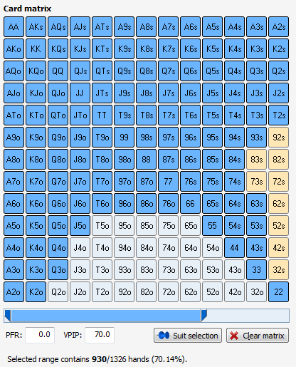
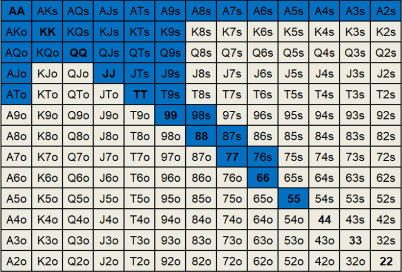
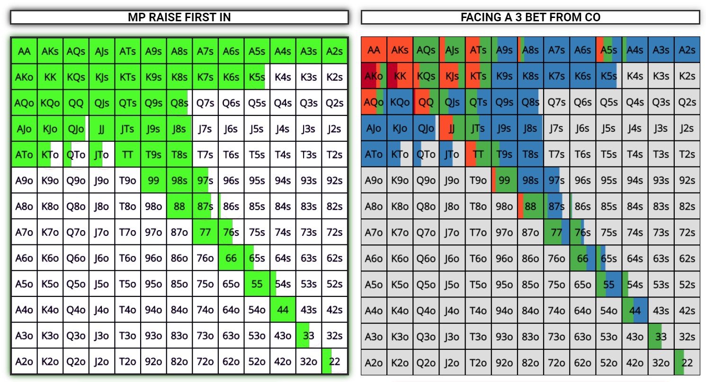

# Texas Hold'em Heads-Up Poker against AI
___

___
__Техасский холдем__ является самым популярным видом покера. Раньше я играл за столами с _9_ и _6_ игроками. Однако, спустя некоторое время я решил начать играть в хэдс-ап (игра один на один). Основная разница в динамике игры- это агрессия. В отличие от столов с _9_ и _6_ игроками ты должен играть около __80%__ рук, в зависимости от баланса. Чем ниже баланс, тем агрессивнее должен быть стиль игры из-за ограниченного количества способов защиты своей руки.

Ниже представлен упрощенный чарт рук, разыгрываемых игроком префлоп в хэдс-ап:



Пассивный розыгрыш этих рук неэффективен. Это означает, что игроку следует периодически поднимать ставку вместо пассивного уравнивания. Учитывая динамику игры, игрок должен поднимать ставку даже если на флопе данную руку будет разыгрывать некомфортно. Ниже представлен чарт рук, с которыми игроку следует поднимать ставку префлоп:



Это означает, что игроку следует поднимать ставку примерно в __25%__ случаев префлоп.

На флопе динамика игры остается агрессивной. Игроку следует делть ставку вместо того, чтобы пропускать ход. Однако его ответный ход на рейзы должен оставаться гибким. Ниже представлен чарт рук, разыгрываемых при ререйзе противника:



Следование данной стратегии является сложной задачей. Гораздо проще играть прямолинейно, но это невыгодно. 
___
# Код 

ИИ в данном проекте не является сложным и может быть значительно улучшен, но это не означает, что против него скучно играть. Добавление условий и понимания ценности карт улучшило бы ИИ. Однако я решил не тратить слишком много времени на написание кода, который я уже знаю как писать, сосредоточившись на правильной работе игры.

Ниже представлен пример того, как ИИ ведёт себя при ререйзе от игрока:

```Python
if opponents_balance >= int(reraise) - 6*small_blind:
    if 0 <= random.random() <= 0.5:
        print(f"Opponent called ${int(reraise)-6*small_blind}")
        bank = bank + int(reraise) - 6*small_blind
        opponents_balance = opponents_balance - int(reraise) + 6 * small_blind
        print(f"Your balance: ${balance}, opponent's balance: ${opponents_balance}")
        print(f"Bank: ${bank}")
```

Reading the [code](Poker_Playground.py) would be enough to understand the AI strategy.

I guess one of the most difficult challenges for me was writing the _'combinations'_ function, which checks all possible combinations and assigns a value to each of them. The code snippet below demonstrates how I executed it:

```Python
ranks_count = {'2': 1, '3': 2, '4': 3, '5': 4, '6': 5, '7': 6, '8': 7, '9': 8, 'T': 9, 'J': 10, 'Q': 11, 'K': 12, 'A': 13}
    
    def check_royal_flash(cards):
        values_r = [i[0] for i in cards]
        if check_flush(cards) and check_street(cards) and sorted(values_r) == ['A', 'J', 'K', 'Q', 'T']:
            return True
        else:
            return False

    def check_street_flush(cards):
        if check_flush(cards) and check_street(cards):
            return True
        else:
            return False
        
    def check_four_of_a_kind(cards):
        values = [i[0] for i in cards]
        value_counts = defaultdict(lambda: 0)
        for v in values:
            value_counts[v] += 1
        if sorted(value_counts.values()) == [1, 4]:
            return True
        else:
            return False
        
    def check_full_house(cards):
        values = [i[0] for i in cards]
        value_counts = defaultdict(lambda: 0)
        for v in values:
            value_counts[v] += 1
        if sorted(value_counts.values()) == [2, 3]:
            return True
        else:
            return False
        
    def check_flush(cards):
        value = [i[1] for i in cards]
        if len(set(value)) == 1:
            return True
        else:
            return False
        
    def check_street(cards):
        values = [i[0] for i in cards]
        value_counts = defaultdict(lambda: 0)
        for v in values:
            value_counts[v] += 1
        rank_score = [ranks_count[i] for i in values]
        rank_range = max(rank_score) - min(rank_score)
        if rank_range == 4 and len(set(value_counts.values())) == 1:
            return True
        else:
            if set(values) == set(['A', '2', '3', '4', '5']):
                return True
            return False
        
    def check_three_of_a_kind(cards):
        values = [i[0] for i in cards]
        value_counts = defaultdict(lambda: 0)
        for v in values:
            value_counts[v] += 1
        if sorted(value_counts.values()) == [1, 1, 3]:
            return True
        else:
            return False
        
    def check_two_pairs(cards):
        values = [i[0] for i in cards]
        value_counts = defaultdict(lambda: 0)
        for v in values:
            value_counts[v] += 1
        if sorted(value_counts.values()) == [1, 2, 2]:
            return True
        else:
            return False
        
    def check_one_pair(cards):
        values = [i[0] for i in cards]
        value_counts = defaultdict(lambda: 0)
        for v in values:
            value_counts[v] += 1
        if sorted(value_counts.values()) == [1, 1, 1, 2]:
            return True
        else:
            return False

    if check_royal_flash(cards) == True:
        return 10
    elif check_street_flush(cards) == True:
        return 9
    elif check_four_of_a_kind(cards) == True:
        return 8
    elif check_full_house(cards) == True:
        return 7
    elif check_flush(cards) == True:
        return 6
    elif check_street(cards) == True:
        return 5
    elif check_three_of_a_kind(cards) == True:
        return 4
    elif check_two_pairs(cards) == True:
        return 3
    elif check_one_pair(cards) == True:
        return 2
    else:
        return 1
```

One more intriguing function is _'play'_. It takes two variables: _'dec'_, which represents the _5_ cards from all rounds of play, and _'hand'_, indicating the player's or opponent's _2_ cards. The function proceeds to generate all possible _5-card combinations_ from the _7_ available cards and evaluates their values. Ultimately, it returns the combination with the highest score. Below is the corresponding code snippet:

```Python
def play(hand, dec):
    # The riv variable is a deck containing 7 cards, 2 from the player/opponent and 5 from 3 rounds of playing
    riv = hand + dec
    best_hand = 0
    possible_combos = itertools.combinations(riv, 5)
    possible_combos = list(possible_combos)
    
    for c in possible_combos:
        current_hand = list(c)
        hand_value = combination(current_hand)
        if hand_value > best_hand:
            best_hand = hand_value
    return hand_dict[best_hand], best_hand
```

After completing the project, I came to realize that I derived more enjoyment from debugging the code than actually playing poker. There are numerous ways in which this code could be enhanced, particularly in terms of its architecture. However, the process of writing nearly 1200 lines of code from scratch proved to be an essential learning experience.

