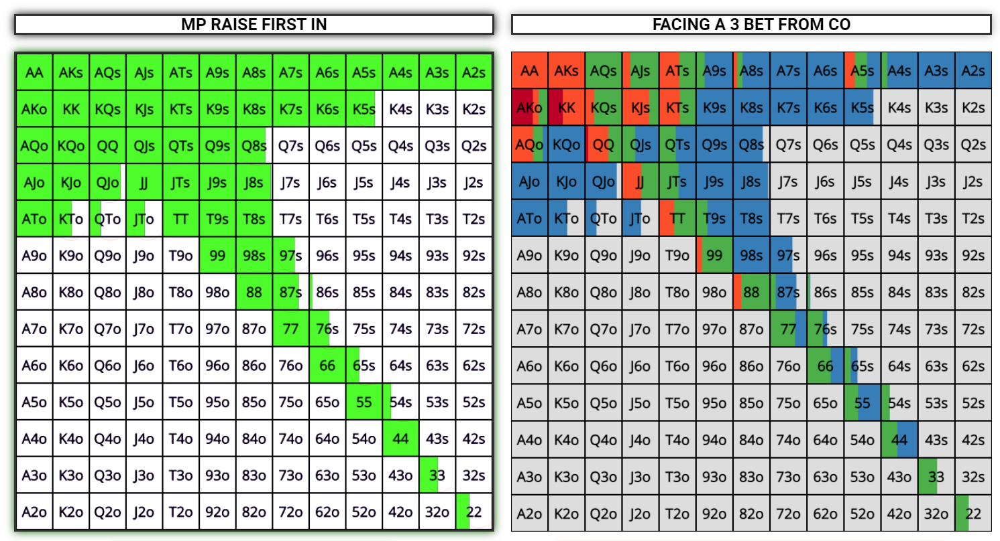

## Texas Hold'em Heads-Up Poker against AI
___

___
__Texas Hold'em__ is the most popular type of poker. I used to play it at tables with _9_ and _6_ people mostly. However, after a while, I decided to challenge myself and started playing Heads-Up. The main difference is that the dynamic of this game is aggressive. Unlike at tables with _9_ and _5_ players, you have to play around __80%__ of the dealt hands, depending on your balance. The lower your balance, the more aggressive your style must be due to the limited ways of protecting your hands.

Here is the simplified chart of pre-flop hands that a player should play in a heads-up game:


But playing all these hands passively isn't efficient. This means a player should consider raising instead of calling. Given the dynamic of the game, a player must raise even when he has hands that might be uncomfortable to play with after the preflop. The chart below displays hands that a player should raise preflop:


It means a player raises approximately __25%__ of his hands preflop.

After the preflop, the dynamic of the game remains aggressive. A player should bet rather than check. However, his response to raises must be flexible. Here is the chart indicating a player's behavior on _3-bets_:



The most difficult part is adhering to the plan. It's easy but not profitable to play straightforwardly. Staying devoid of emotions is key to playing successfully. This is where a computer comes in handy.
___
Even though the AI is not sophisticated and could be significantly enhanced, it still might be fun to play against it. Adding more conditions and ensuring that the AI understands the value of cards would improve the experience. However, I chose to simplify it so as not to spend too much time on writing code that I already know how to write.

Here is a code snippet illustrating one of the ways the AI handles a _reraise_ from a player:

```Python
if opponents_balance >= int(reraise) - 6*small_blind:
    if 0 <= random.random() <= 0.5:
        print(f"Opponent called ${int(reraise)-6*small_blind}")
        bank = bank + int(reraise) - 6*small_blind
        opponents_balance = opponents_balance - int(reraise) + 6 * small_blind
        print(f"Your balance: ${balance}, opponent's balance: ${opponents_balance}")
        print(f"Bank: ${bank}")
```

Reading the [code](Poker_Playground.py) would be enough to understand the AI strategy.

I guess one of the most difficult challenges for me was writing the _'combinations'_ function, which checks all possible combinations and assigns a value to each of them. The code snippet below demonstrates how I executed it:

```Python
ranks_count = {'2': 1, '3': 2, '4': 3, '5': 4, '6': 5, '7': 6, '8': 7, '9': 8, 'T': 9, 'J': 10, 'Q': 11, 'K': 12, 'A': 13}
    
    def check_royal_flash(cards):
        values_r = [i[0] for i in cards]
        if check_flush(cards) and check_street(cards) and sorted(values_r) == ['A', 'J', 'K', 'Q', 'T']:
            return True
        else:
            return False

    def check_street_flush(cards):
        if check_flush(cards) and check_street(cards):
            return True
        else:
            return False
        
    def check_four_of_a_kind(cards):
        values = [i[0] for i in cards]
        value_counts = defaultdict(lambda: 0)
        for v in values:
            value_counts[v] += 1
        if sorted(value_counts.values()) == [1, 4]:
            return True
        else:
            return False
        
    def check_full_house(cards):
        values = [i[0] for i in cards]
        value_counts = defaultdict(lambda: 0)
        for v in values:
            value_counts[v] += 1
        if sorted(value_counts.values()) == [2, 3]:
            return True
        else:
            return False
        
    def check_flush(cards):
        value = [i[1] for i in cards]
        if len(set(value)) == 1:
            return True
        else:
            return False
        
    def check_street(cards):
        values = [i[0] for i in cards]
        value_counts = defaultdict(lambda: 0)
        for v in values:
            value_counts[v] += 1
        rank_score = [ranks_count[i] for i in values]
        rank_range = max(rank_score) - min(rank_score)
        if rank_range == 4 and len(set(value_counts.values())) == 1:
            return True
        else:
            if set(values) == set(['A', '2', '3', '4', '5']):
                return True
            return False
        
    def check_three_of_a_kind(cards):
        values = [i[0] for i in cards]
        value_counts = defaultdict(lambda: 0)
        for v in values:
            value_counts[v] += 1
        if sorted(value_counts.values()) == [1, 1, 3]:
            return True
        else:
            return False
        
    def check_two_pairs(cards):
        values = [i[0] for i in cards]
        value_counts = defaultdict(lambda: 0)
        for v in values:
            value_counts[v] += 1
        if sorted(value_counts.values()) == [1, 2, 2]:
            return True
        else:
            return False
        
    def check_one_pair(cards):
        values = [i[0] for i in cards]
        value_counts = defaultdict(lambda: 0)
        for v in values:
            value_counts[v] += 1
        if sorted(value_counts.values()) == [1, 1, 1, 2]:
            return True
        else:
            return False

    if check_royal_flash(cards) == True:
        return 10
    elif check_street_flush(cards) == True:
        return 9
    elif check_four_of_a_kind(cards) == True:
        return 8
    elif check_full_house(cards) == True:
        return 7
    elif check_flush(cards) == True:
        return 6
    elif check_street(cards) == True:
        return 5
    elif check_three_of_a_kind(cards) == True:
        return 4
    elif check_two_pairs(cards) == True:
        return 3
    elif check_one_pair(cards) == True:
        return 2
    else:
        return 1
```

One more intriguing function is _'play'_. It takes two variables: _'dec'_, which represents the _5_ cards from all rounds of play, and _'hand'_, indicating the player's or opponent's _2_ cards. The function proceeds to generate all possible _5-card combinations_ from the _7_ available cards and evaluates their values. Ultimately, it returns the combination with the highest score. Below is the corresponding code snippet:

```Python
def play(hand, dec):
    # The riv variable is a deck containing 7 cards, 2 from the player/opponent and 5 from 3 rounds of playing
    riv = hand + dec
    best_hand = 0
    possible_combos = itertools.combinations(riv, 5)
    possible_combos = list(possible_combos)
    
    for c in possible_combos:
        current_hand = list(c)
        hand_value = combination(current_hand)
        if hand_value > best_hand:
            best_hand = hand_value
    return hand_dict[best_hand], best_hand
```

After completing the project, I came to realize that I derived more enjoyment from debugging the code than actually playing poker. There are numerous ways in which this code could be enhanced, particularly in terms of its architecture. However, the process of writing nearly 1200 lines of code from scratch proved to be an essential learning experience.


